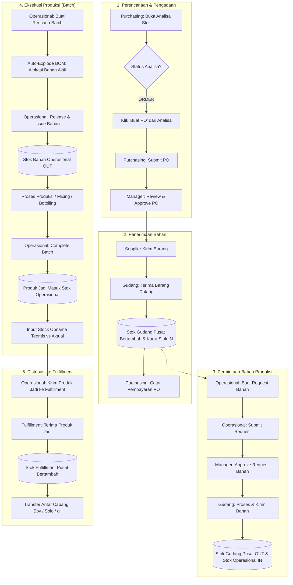
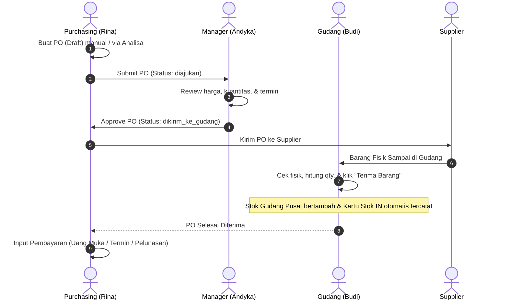
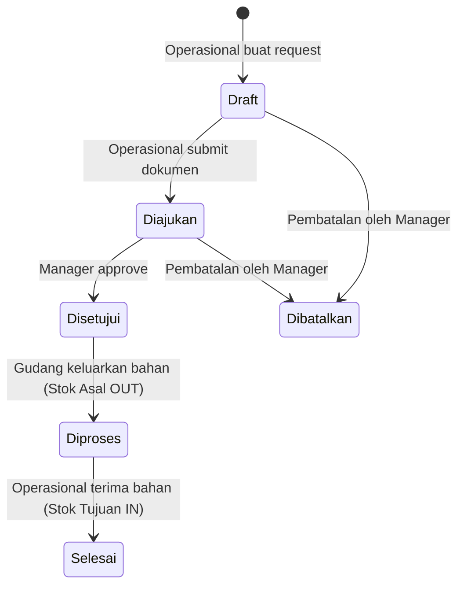
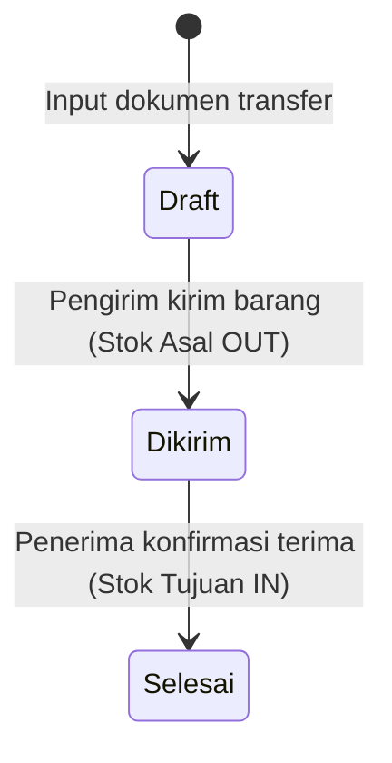
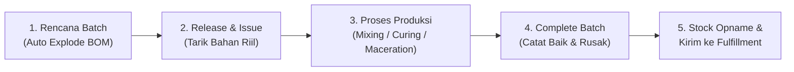

# 📖 PANDUAN DAN DOKUMENTASI FLOW BISNIS SISTEM SUPPLY CHAIN (SC ONLINE)
**CV. Heaven Scent — Divisi IT & Rantai Pasok**  
*Dokumen Acuan Pengguna & Standard Operating Procedure (SOP) Digital*

---

## 📌 Daftar Isi
1. [Pengenalan Ekosistem SC Online](#1-pengenalan-ekosistem-sc-online)
2. [Peta Peran & Tanggung Jawab (5 Persona)](#2-peta-peran--tanggung-jawab-5-persona)
3. [Diagram Alur Bisnis Makro (End-to-End Value Stream)](#3-diagram-alur-bisnis-makro-end-to-end-value-stream)
4. [Panduan Langkah Demi Langkah per Modul](#4-panduan-langkah-demi-langkah-per-modul)
   - [Modul 1: Analisa Stok & Alert Stock 2 Kolom](#modul-1-analisa-stok--alert-stock-2-kolom)
   - [Modul 2: Purchasing & Pembayaran Bertahap](#modul-2-purchasing--pembayaran-bertahap)
   - [Modul 3: Request & Transfer (Mesin Mutasi Stok Internal)](#modul-3-request--transfer-mesin-mutasi-stok-internal)
   - [Modul 4: Produksi Parfum (Siklus Batch & BOM)](#modul-4-produksi-parfum-siklus-batch--bom)
   - [Modul 5: Stok, Mutasi & Kartu Stok (Audit Trail)](#modul-5-stok-mutasi--kartu-stok-audit-trail)
5. [Panduan Pengujian Cepat (Quick Role Switcher)](#5-panduan-pengujian-cepat-quick-role-switcher)
6. [Matriks Hak Akses & Kewenangan Approval](#6-matriks-hak-akses--kewenangan-approval)
7. [Tanya Jawab & Troubleshooting (FAQ)](#7-tanya-jawab--troubleshooting-faq)

---

## 1. Pengenalan Ekosistem SC Online

**SC Online Heaven Scent** adalah sistem terintegrasi yang mengelola seluruh rantai pasok parfum dari hulu ke hilir:
- **Pengadaan:** Pembelian bahan baku (alkohol, bibit parfum/oil) dan bahan kemas (botol, tutup, kardus).
- **Manajemen Gudang:** Penyimpanan bahan di Gudang Pusat dan distribusi ke Gudang Operasional.
- **Produksi:** Perencanaan batch produksi, auto-explode Resep/BOM, pelepasan bahan riil (*Release & Issue*), kontrol kualitas (yield/defect), dan pencatatan produk jadi.
- **Fulfillment:** Analisa kebutuhan cabang, mutasi antar-hub/cabang, hingga stok siap didistribusikan ke customer.

> [!IMPORTANT]
> **Prinsip Dasar Sistem:**
> 1. **Single Source of Truth:** Seluruh Batas Minimum dan Target Stock bersumber tunggal dari modul **Analisa Stok** (bukan diinput manual sembarangan).
> 2. **Alert Stock 2 Kolom:** Peringatan stok dibedakan menjadi **Kolom Stok** (kondisi fisik nyata) dan **Kolom Rencana** (kondisi mendatang yang telah memperhitungkan Rencana Produksi).
> 3. **Append-Only Ledger:** Setiap pergerakan barang (masuk/keluar) wajib tercatat di **Kartu Stok** dengan referensi dokumen transaksi yang jelas.

---

## 2. Peta Peran & Tanggung Jawab (5 Persona)

Sistem membagi tugas harian ke dalam 5 peran (*role*) yang saling berkolaborasi:

| Peran | Persona Default | Tanggung Jawab Utama | Menu yang Diakses |
| :--- | :--- | :--- | :--- |
| **Purchasing** | **Rina** (`purchasing@heavenscent.id`) | Melakukan analisa kebutuhan bahan baku/kemas, membuat Purchase Order (PO) ke supplier, dan mencatat histori pembayaran (termin/pelunasan). | Dashboard, Purchasing, Analisa Stok, Stok & Mutasi, Master Data, Laporan |
| **Gudang** | **Budi** (`gudang@heavenscent.id`) | Menerima fisik barang datang dari supplier (PO), menyimpan bahan di Gudang Bahan Baku Pusat, dan memproses pengiriman bahan ke bagian produksi. | Dashboard, Request & Transfer, Stok & Mutasi, Master Data, Laporan |
| **Operasional** | **Dedi** (`operasional@heavenscent.id`) | Mengajukan permintaan bahan, membuat rencana produksi parfum (*Batch*), mengeksekusi produksi (*Release & Issue*), mencatat barang jadi, dan mengirim produk jadi ke fulfillment. | Dashboard, Produksi, Request & Transfer, Stok & Mutasi, Master Data, Laporan |
| **Fulfillment** | **Sari** (`fulfillment@heavenscent.id`) | Menganalisa kebutuhan produk jadi di gudang cabang (Pusat, Surabaya, Solo), menerima kiriman produk jadi dari produksi, dan mendistribusikannya antar cabang. | Dashboard, Analisa Stok, Request & Transfer, Stok & Mutasi, Master Data, Laporan |
| **Manager** | **Andyka** (`manager@heavenscent.id`) | Memantau seluruh aktivitas rantai pasok melalui Dashboard KPI, menyetujui (*Approve*) Purchase Order, menyetujui Request Bahan, dan mengelola pengguna. | Seluruh Menu Aplikasi (Akses Penuh & Hak Approval) |

---

## 3. Diagram Alur Bisnis Makro (End-to-End Value Stream)

Berikut adalah visualisasi alur pergerakan barang dan data dari pengadaan hingga ke gudang cabang:



---

## 4. Panduan Langkah Demi Langkah per Modul

---

### Modul 1: Analisa Stok & Alert Stock 2 Kolom

Modul ini adalah **otak kalkulasi** yang menentukan kapan barang harus dibeli atau diproduksi ulang.

#### A. Membaca Alert Stock 2 Kolom (Menu: *Stok & Mutasi*)
Saat membuka menu **Stok & Mutasi**, Anda akan melihat dua kolom status peringatan:

```text
+---------------+---------------+-----------------------+-----------------------+
| SKU / Nama    | Batas Minimum | Kolom Stok (Fisik)    | Kolom Rencana         |
+---------------+---------------+-----------------------+-----------------------+
| ALK-01        | 31.442,60 ml  | 8.000,00 [ORDER]      | -2.000,00 [ORDER]     |
| GOH-P50       | 500 pcs       | 1.200 pcs [AMAN]      | 1.450 pcs [AMAN]      |
+---------------+---------------+-----------------------+-----------------------+
```

1. **Batas Minimum:** Nilai safety threshold yang dihitung otomatis oleh modul Analisa Stok.
2. **Kolom Stok (Kondisi Nyata Saat Ini):**
   - Rumus: `Stok Fisik Gudang + Inbound PO/RT yang sedang dalam perjalanan`.
   - Menjawab: *"Apakah stok fisik kita saat ini masih aman untuk operasional harian?"*
3. **Kolom Rencana (Kondisi Masa Depan):**
   - Untuk Bahan Baku: `(Stok Fisik + Inbound PO) − Alokasi Rencana Produksi Aktif`.
   - Untuk Produk Jadi: `(Stok Fisik + Inbound RT) + Rencana Produksi Selesai Mendatang`.
   - Menjawab: *"Jika seluruh batch yang masih berupa rencana dieksekusi, apakah stok bahan kita akan tekor (minus)?"*
4. **Indikator Badge:**
   - <span style="color:red; font-weight:bold;">ORDER (Merah):</span> Nilai $\le$ Batas Minimum. **Wajib segera dilakukan pemesanan (PO) atau request bahan!**
   - <span style="color:green; font-weight:bold;">AMAN (Hijau):</span> Nilai $>$ Batas Minimum. Stok dalam batas aman.

#### B. Mengoperasikan Analisa Stok (Menu: *Analisa Stok*)
Tersedia 3 tab profil sesuai karakteristik barang:
1. **Bahan Lokal:** Menghitung Average Daily Usage (ADU), Total Lead Time, Buffer Hari, Batas Minimum, Target Stock, dan membulatkan pesanan ke kelipatan Minimum Order Quantity (MOQ).
2. **Bahan Impor:** Menghitung kebutuhan bahan impor per varian botol/tutup berdasarkan persentase distribusi historis dan klasifikasi ABC.
3. **Produk Jadi (Fulfillment):** Mengagregasi kebutuhan produk jadi lintas gudang cabang (Pusat, Surabaya, Solo).

**Aksi yang Tersedia:**
- **Buat PO:** Centang item yang berstatus `ORDER`, lalu klik **"Buat PO"**. Sistem akan otomatis membuat dokumen *Draft Purchase Order* ke supplier terkait.
- **Simpan Snapshot:** Klik tombol **"Simpan Snapshot"** di pojok kanan atas untuk membekukan (*freeze*) data analisa hari ini ke dalam tab **Riwayat Analisa** sebagai arsip audit.

---

### Modul 2: Purchasing & Pembayaran Bertahap

Alur pengadaan bahan baku/kemas ke supplier pihak ketiga.



#### Langkah Praktis:
1. **Membuat PO (Purchasing):** Buka menu *Purchasing* ➔ klik *Tambah PO* ➔ Pilih Supplier, tanggal, estimasi kedatangan (ETA), sumber dana, serta daftar SKU dan harga total ➔ Simpan (*Status: Draft*).
2. **Mengajukan ke Manager (Purchasing):** Pada halaman detail PO, klik tombol **"Ajukan ke Manager"** (*Status: Diajukan*).
3. **Approval PO (Manager):** Manager login ➔ Buka detail PO ➔ klik tombol **"Setujui PO"** (*Status: Dikirim ke Gudang*).
4. **Penerimaan Barang Fisik (Gudang):** 
   - Petugas Gudang membuka menu *Purchasing* atau melihat antrean tindakan di *Dashboard*.
   - Buka PO terkait ➔ Pada form **Penerimaan Barang Datang**, pilih gudang penerima (Gudang Bahan Baku Pusat), tanggal terima, kondisi barang (Baik / Rusak Sebagian), dan masukkan kuantitas fisik yang diterima ➔ Klik **"Simpan Penerimaan"**.
   - **Efek Sistem:** Status PO berubah menjadi `Selesai`, saldo stok bertambah seketika, dan tercatat di Kartu Stok.
5. **Pencatatan Pembayaran (Purchasing):**
   - Pada halaman detail PO, buka bagian **Riwayat Pembayaran**.
   - Masukkan skema (`Termin`, `Tempo`, atau `Pelunasan`), tanggal bayar, dan nominal transfer ➔ Klik **"Catat Pembayaran"**.

> [!TIP]
> **Pembatalan PO:** Jika supplier membatalkan pesanan atau terjadi salah input, Purchasing atau Manager dapat mengklik tombol **"Batalkan PO"** selama barang belum diterima.

---

### Modul 3: Request & Transfer (Mesin Mutasi Stok Internal)

Seluruh perpindahan barang antar-gudang di dalam perusahaan diatur oleh satu mesin generik dengan **2 macam alur (pipeline)**:

#### Pipeline A: Request 5-Tahap dengan Approval Manager (Khusus `Request Bahan`)
Digunakan saat bagian Produksi (Operasional) meminta bahan baku dari Gudang Utama.



1. **Buat Request (Operasional):** Buka *Request & Transfer* ➔ *Buat Permintaan* ➔ Jenis: `Request Bahan` ➔ Asal: Gudang Bahan Baku Pusat, Tujuan: Gudang Operasional ➔ Isi item & kuantitas ➔ Simpan.
2. **Submit:** Klik tombol **"Ajukan"**.
3. **Approval (Manager):** Manager membuka dokumen dan mengklik tombol **"Setujui"**.
4. **Proses & Kirim (Gudang):** Petugas Gudang menyiapkan barang fisik lalu mengklik tombol **"Proses & Kirim"**. Saldo stok di Gudang Bahan Baku Pusat **otomatis terpotong**.
5. **Terima Barang (Operasional):** Saat bahan tiba di ruang produksi, Operasional memeriksa kuantitas dan mengklik tombol **"Konfirmasi Terima"**. Saldo stok di Gudang Operasional **otomatis bertambah**.

---

#### Pipeline B: Transfer Langsung 3-Tahap tanpa Approval
Digunakan untuk pengiriman produk jadi (`kirim_produk_jadi`), distribusi antar-cabang (`antar_fulfillment`), dan retur bahan/produk.



1. **Buat Dokumen (Pengirim):** Pilih jenis transfer, gudang asal, gudang tujuan, dan kuantitas barang.
2. **Kirim Barang:** Klik **"Kirim Barang"**. Saldo stok gudang asal langsung berkurang (*Status: Dikirim*).
3. **Terima Barang (Penerima):** Gudang tujuan menerima barang fisik dan mengklik **"Konfirmasi Terima"**. Saldo stok gudang tujuan bertambah (*Status: Selesai*).

---

### Modul 4: Produksi Parfum (Siklus Batch & BOM)

Modul ini mengelola proses peracikan parfum mulai dari bahan mentah hingga menjadi botol parfum siap jual.



#### Tahapan Eksekusi Batch:
1. **Membuat Rencana Batch (Status: `Rencana`):**
   - Buka menu *Produksi* ➔ Klik *Rencana Batch Baru*.
   - Pilih Produk Jadi (misal: `Parfum GOH 50ml`), Qty Target (misal: `500 pcs`), Gudang Operasional, dan Tanggal.
   - **Efek Sistem:** Sistem secara otomatis membaca Resep (BOM) produk tersebut dan membuat data **Alokasi Bahan Aktif** (misal: 20.000 ml alkohol, 4.000 ml concentrate oil, 500 botol, 500 tutup).
   - *Penting:* Pada tahap ini, stok fisik belum dipotong, namun ketersediaan di Kolom Rencana Stok sudah memberikan sinyal peringatan dini!
2. **Release & Issue Bahan (Status: `Release`):**
   - Saat proses peracikan di lab/ruang produksi akan dimulai, klik tombol **"Release & Issue Bahan"**.
   - **Efek Sistem:** Stok bahan baku di Gudang Operasional **terpotong secara riil**, kartu stok keluar (`out`) tercatat, dan status alokasi bahan berubah menjadi `Dilepas`.
   - *Catatan:* Jika saldo bahan di gudang operasional kurang, sistem akan menolak release demi menjaga integritas data.
3. **Menyelesaikan Batch (Status: `Selesai`):**
   - Setelah botol parfum selesai diisi, dipress, dan dikemas, klik tombol **"Selesaikan Batch"**.
   - Masukkan kuantitas hasil produksi:
     - **Qty Baik:** Jumlah botol parfum yang lolos uji QC (misal: `490 pcs`).
     - **Qty Rusak (Defect):** Jumlah botol pecah/bocor/reject (misal: `10 pcs`).
   - **Efek Sistem:** Sistem menghitung persentase **Yield** (misal: `98.0%`), dan Qty Baik **otomatis masuk ke saldo stok produk jadi** di gudang operasional!
4. **Stock Opname Batch (BOM Teoritis vs Aktual):**
   - Pada detail batch, terdapat tabel opname untuk membandingkan takaran teoritis BOM dengan pemakaian aktual di lapangan (misal: alkohol tumpah 100 ml). Masukkan data pemakaian riil untuk kebutuhan audit dan analisa efisiensi bahan.
5. **Kirim Produk Jadi ke Fulfillment:**
   - Klik tombol **"Ajukan Kirim ke Fulfillment"**.
   - Sistem akan otomatis membuatkan dokumen *Request & Transfer* jenis `kirim_produk_jadi` untuk dikirimkan ke bagian Fulfillment.

> [!NOTE]
> **Pembatalan Batch:** Batch yang masih berstatus `Rencana` dapat dibatalkan kapan saja dengan mengklik tombol **"Batalkan Batch"**. Alokasi bahan akan otomatis dilepas kembali tanpa menyebabkan mutasi fisik pada stok.

---

### Modul 5: Stok, Mutasi & Kartu Stok (Audit Trail)

Modul ini adalah buku besar (*ledger*) persediaan barang.

1. **Melihat Saldo Stok:**
   - Menampilkan saldo per SKU per gudang lengkap dengan Batas Minimum Analisa Stok.
   - Kolom Stok Fisik dan Kolom Rencana dilengkapi badge warna yang interaktif.
2. **Kartu Stok (Ledger Append-Only):**
   - Klik tombol **"Kartu Stok"** pada baris SKU tertentu untuk melihat rekaman kronologis setiap transaksi.
   - Menampilkan tanggal, gudang, jenis transaksi (`purchase_order`, `batch_produksi`, `request_transfer`, `mutasi_manual`), kuantitas masuk/keluar, dan saldo setelah transaksi.
3. **Stock Opname Berkala:**
   - Fitur untuk mencocokkan stok fisik di rak gudang dengan sistem secara berkala. Selisih penyesuaian akan otomatis dicatat sebagai transaksi mutasi opname.

---

## 5. Panduan Pengujian Cepat (Quick Role Switcher)

Untuk mempermudah pengujian alur kerja lintas divisi pada lingkungan pengembangan (*local testing*), telah disediakan fitur **Quick Role Switcher** sehingga tester tidak perlu logout dan login kembali secara berulang:

### Cara Menggunakan:
1. **Melalui Navbar Atas (Saat Sudah Login):**
   - Lihat di bilah atas (*top navbar*) sebelah kanan. Terdapat tombol dropdown berwarna kuning dengan animasi titik pulsa:  
     `⚡ Peran: [ Manager (Andyka) ▼ ]`
   - Klik dropdown tersebut dan pilih salah satu persona:
     - `Manager (Andyka)`
     - `Purchasing (Rina)`
     - `Gudang (Budi)`
     - `Operasional (Dedi)`
     - `Fulfillment (Sari)`
   - Halaman akan otomatis berganti ke user tersebut seketika. Menu sidebar dan izin aksi langsung menyesuaikan dengan wewenang role yang dipilih.
2. **Melalui Halaman Login:**
   - Pada halaman `/login`, terdapat 5 tombol cepat di bawah form login:  
     `[Manager]  [Purchasing]  [Gudang]  [Operasional]  [Fulfillment]`
   - Klik salah satu tombol untuk langsung masuk tanpa perlu memasukkan email dan kata sandi.

---

## 6. Matriks Hak Akses & Kewenangan Approval

| Menu / Aksi Bisnis | Purchasing | Gudang | Operasional | Fulfillment | Manager |
| :--- | :---: | :---: | :---: | :---: | :---: |
| **Dashboard KPI** | ✅ | ✅ | ✅ | ✅ | ✅ |
| **Lihat Analisa Stok** | ✅ | ❌ | ❌ | ✅ | ✅ |
| **Buat PO dari Analisa / Manual** | ✅ | ❌ | ❌ | ❌ | ✅ |
| **Approve PO (Persetujuan)** | ❌ | ❌ | ❌ | ❌ | ✅ |
| **Penerimaan Barang PO (Gudang)** | ❌ | ✅ | ❌ | ❌ | ✅ |
| **Catat Pembayaran PO** | ✅ | ❌ | ❌ | ❌ | ✅ |
| **Buat Request Bahan Produksi** | ❌ | ❌ | ✅ | ❌ | ✅ |
| **Approve Request Bahan** | ❌ | ❌ | ❌ | ❌ | ✅ |
| **Proses Kirim Bahan ke Lab** | ❌ | ✅ | ❌ | ❌ | ✅ |
| **Buat Rencana Batch Produksi** | ❌ | ❌ | ✅ | ❌ | ✅ |
| **Release & Issue Bahan Batch** | ❌ | ❌ | ✅ | ❌ | ✅ |
| **Selesaikan Batch (QC Hasil)** | ❌ | ❌ | ✅ | ❌ | ✅ |
| **Kirim Produk Jadi ke Fulfillment** | ❌ | ❌ | ✅ | ✅ | ✅ |
| **Lihat Stok & Kartu Stok** | ✅ | ✅ | ✅ | ✅ | ✅ |
| **Master Data (Produk, Gudang, BOM)** | ✅ | ✅ | ✅ | ✅ | ✅ |
| **Kelola Pengguna (Admin User)** | ❌ | ❌ | ❌ | ❌ | ✅ |

---

## 7. Tanya Jawab & Troubleshooting (FAQ)

### Q1: Mengapa stok fisik botol di gudang masih ada 5.000 pcs, tetapi Kolom Rencana menunjukkan status `ORDER` berwarna merah?
> **Jawaban:**  
> Kolom Rencana memperhitungkan rencana produksi yang sedang aktif. Jika Anda memiliki 3 Rencana Batch yang membutuhkan total 6.000 botol, maka kuantitas rencana menjadi $5.000 - 6.000 = -1.000$ pcs. Sistem memberikan peringatan dini agar bagian Purchasing segera memesan botol sebelum batch tersebut di-release.

### Q2: Mengapa tombol "Release & Issue" pada Batch Produksi gagal dan muncul pesan error?
> **Jawaban:**  
> Tombol Release membutuhkan saldo fisik bahan yang cukup di **Gudang Operasional**. Jika bahan masih berada di **Gudang Bahan Baku Pusat**, bagian Operasional harus membuat dokumen **Request Bahan** terlebih dahulu agar stok dipindahkan ke Gudang Operasional.

### Q3: Bagaimana jika supplier mengirim barang dalam beberapa tahap (pengiriman parsial)?
> **Jawaban:**  
> Pada form Penerimaan Barang Datang di menu Purchasing, petugas gudang dapat memasukkan kuantitas sesuai yang riil datang saat itu. Sisa kuantitas yang belum datang akan tetap tercatat dan dapat diterima pada kedatangan berikutnya.

### Q4: Apakah pembatalan Rencana Batch akan mengurangi stok bahan?
> **Jawaban:**  
> **Tidak.** Batch berstatus `Rencana` baru mengikat alokasi secara logis. Jika dibatalkan, alokasi tersebut langsung dilepas kembali dan stok fisik bahan tidak mengalami perubahan sama sekali.

---
*Dokumen ini disusun untuk memastikan keselarasan alur kerja seluruh divisi dan keandalan sistem SC Online Heaven Scent.*
